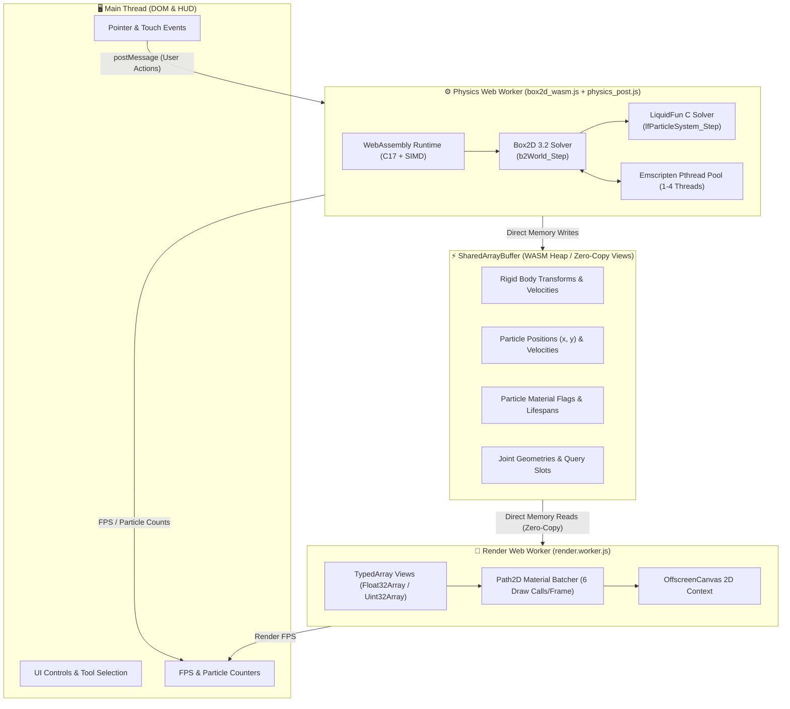

# Box2D 3.2 C + LiquidFun WASM & SharedArrayBuffer

[](https://en.wikipedia.org/wiki/C17_(C_standard_revision))
[](https://webassembly.org/)
[-brightgreen)](https://github.com/erincatto/box2d)
[](https://google.github.io/liquidfun/)
[](https://emscripten.org/)
[](https://opensource.org/licenses/Zlib)

A high-performance physics simulation engine combining **Erin Catto's modern Box2D 3.2 (pure C17)** with a **complete from-scratch C port of Google's LiquidFun 1.1 particle dynamics**. 

The engine compiles to **WebAssembly** with full **SharedArrayBuffer (SAB)** multi-threading, SIMD vectorization, and zero-copy rendering over dedicated Web Workers.

---

## 📑 Table of Contents

- [Overview](#overview)
- [Architecture & Multi-Threading](#architecture--multi-threading)
- [LiquidFun C Engine Features](#liquidfun-c-engine-features)
  - [Particle Materials & Dynamics](#particle-materials--dynamics)
  - [Spatial Hashing & Solvers](#spatial-hashing--solvers)
  - [Rigid Body Two-Way Coupling](#rigid-body-two-way-coupling)
- [Interactive Web Playground](#interactive-web-playground)
  - [Simulation Presets](#simulation-presets)
  - [Interactive Tools](#interactive-tools)
- [Key Optimizations & Benchmarks](#key-optimizations--benchmarks)
- [Quick Start Guide](#quick-start-guide)
  - [Running the Web Demo](#1-running-the-web-demo)
  - [Building WebAssembly from Source](#2-building-webassembly-from-source)
  - [Building & Running Native C Demos](#3-building--running-native-c-demos)
- [API Reference](#api-reference)
  - [Native C API (`lf_particle_system.h`)](#native-c-api-lf_particle_systemh)
  - [JavaScript API Wrapper (`physics-api.js`)](#javascript-api-wrapper-physics-apijs)
- [SharedArrayBuffer Memory Layout](#sharedarraybuffer-memory-layout)
- [Repository Structure](#repository-structure)
- [License & Acknowledgments](#license--acknowledgments)

---

## Overview

Traditional 2D physics engines struggle when simulating thousands of fluid and granular particles alongside rigid bodies in web environments. This project bridges **Box2D 3.2's** data-oriented solver architecture with **LiquidFun's SPH particle simulation**, re-engineered in pure C17 and optimized for web runtimes.

### Core Highlights:
- **Pure C17 Core**: Zero C++ dependencies. Box2D 3.2 and LiquidFun 1.1 operate as lean, ID-based C libraries.
- **Sidecar Solver Architecture**: Particle dynamics step alongside Box2D rigid bodies without modifying Box2D's internal constraint graph.
- **Zero-Copy SAB Pipeline**: WASM linear memory (`SharedArrayBuffer`) is mapped directly into Float32/Uint32 typed arrays in separate worker threads—completely eliminating message passing serialization overhead.
- **Multi-Material Dynamics**: Water, Viscous Slime, Granular Sand/Powder, Elastic Shape-Matching Jelly, and Pairwise Spring Blobs.
- **SIMD & Multi-Threading**: Emscripten `-msimd128`, `-ffast-math`, Link-Time Optimization (`-flto=full`), and worker thread pools.

---

## Architecture & Multi-Threading

The application uses an isolated three-tier threading model across the browser main thread and dedicated Web Workers:



### Thread Responsibilities:
1. **Main Thread**: Manages DOM inputs, canvas event coordinates, tool selection (emitters, spawners, rays), and HUD telemetry display.
2. **Physics Worker**: Executes `b2World_Step()` and `lfParticleSystem_Step()`. Updates rigid body state channels and particle Structure of Arrays (SoA) directly in the WASM heap.
3. **Render Worker**: Owns the `OffscreenCanvas`. Reads transforms, velocities, flags, and joint metadata directly from `SharedArrayBuffer` views without any postMessage data cloning.

---

## LiquidFun C Engine Features

### Particle Materials & Dynamics

The C port implements the full multi-material spectrum from LiquidFun:

| Material Type | Flag Constant | Color | Physical Behavior & Solver |
| :--- | :--- | :--- | :--- |
| **Water / Fluid** | `lf_waterParticle` (`0`) | `#38bdf8` (Cyan) | SPH density relaxation. Non-divergent pressure impulses resolve overlaps while preserving fluid volume. |
| **Viscous Slime** | `lf_viscousParticle` (`1 << 2`) | `#a855f7` (Purple) | Tangential velocity damping between neighbor particles creates thick, sticky fluids with high shear resistance. |
| **Tensile Fluid** | `lf_tensileParticle` (`1 << 3`) | `#06b6d4` (Teal) | Surface tension attraction pulls neighbor particles together near free surface boundaries to form cohesive droplets. |
| **Granular Powder** | `lf_powderParticle` (`1 << 5`) | `#eab308` (Gold) | Anti-stacking repulsive impulses and granular inter-particle friction create natural avalanches and resting angle of repose. |
| **Elastic Jelly** | `lf_elasticParticle` (`1 << 4`) | `#22c55e` (Green) | Shape-matching deformation solver: computes Center-of-Mass (COM), covariance matrix, and best-fit rigid rotation to apply restoring forces. |
| **Spring Blob** | `lf_springParticle` (`1 << 6`) | `#f43f5e` (Rose) | Hookean pairwise springs captured at group creation. Restores initial inter-particle distances across large strain deformations. |
| **Wall / Barrier** | `lf_wallParticle` (`1 << 1`) | `#64748b` (Slate) | Static, infinite-mass particles serving as fluid boundaries, nozzles, emitters, or breakable dams. |
| **Static Pressure** | `lf_staticPressureParticle` (`1 << 8`) | `#38bdf8` (Cyan) | Poisson-style static pressure solver preventing fluid volume collapse in high-depth or narrow-crevice environments. |

---

### Spatial Hashing & Solvers

The particle pipeline executes a high-speed sub-stepped sequence:

1. **Velocity Integration**: Gravitational acceleration and external forces are applied to particle velocities.
2. **Spatial Hash Grid ($O(N)$)**:
   - Particles are mapped into a 2D uniform grid with cell size equal to particle diameter ($2r$).
   - A $3 \times 3$ cell neighborhood search efficiently identifies interacting candidate pairs.
3. **SPH Density & Weight Accumulation (`ComputeWeight`)**:
   - Computes local particle density proxies from neighbor distance kernels.
4. **Pressure Relaxation (`SolvePressure`)**:
   - Resolves compressive stress by applying equal and opposite impulses along normal contact vectors.
5. **Material Solvers**:
   - `SolveViscous`: Applies tangential damping impulses.
   - `SolvePowder`: Applies extra repulsion to prevent dense stacking.
   - `SolveElastic`: Restores group rest poses using affine covariance transformations.
   - `SolveSpring`: Resolves pairwise Hooke's law spring displacements.
6. **Rigid Body Coupling**:
   - Queries nearby Box2D shapes via `b2World_OverlapAABB` and `b2Shape_GetClosestPoint`.
   - Computes signed penetration depths and applies equal-and-opposite linear impulses to rigid bodies (`b2Body_ApplyLinearImpulse`).
7. **Position Integration & Zombie Compaction (`SolveZombie`)**:
   - Integrates position: $\vec{x}_{t+\Delta t} = \vec{x}_t + \vec{v} \Delta t$.
   - Expired or destroyed particles are swapped with the last element in memory for $O(1)$ compaction.

---

## Interactive Web Playground

The web demo provides an interactive laboratory to test Box2D 3.2 and LiquidFun particle mechanics:

```
+-------------------------------------------------------------------------+
|  Box2D 3.2 + LiquidFun WASM + SAB    Particles: 4250  FPS: 60 / 60 / 60 |
+-------------------------------------------------------------------------+
|                                              | [ LiquidFun Particles ]  |
|                                              | [• Water Stream]         |
|                                              | [• Water Block]          |
|                                              | [• Viscous Slime]        |
|                                              | [• Sand / Powder]        |
|                                              | [• Elastic Jelly]        |
|                                              | [• Spring Blob]          |
|                                              |                          |
|                                              | [ Box2D Rigid Bodies ]   |
|                                              | [• Dynamic Box]          |
|                                              | [• Dynamic Circle]       |
|                                              | [• Ray Cast (Drag)]      |
|                                              |                          |
|                                              | [ Presets ]              |
|                                              | [🌊 Sandbox]             |
|                                              | [🧱 Dam Break]           |
|                                              | [🍮 Jelly Drop]          |
|                                              | [⏳ Sand Funnel]          |
|                                              | [🏊 Wave Pool]           |
|                                              |                          |
|                                              | [ Actions ]              |
|                                              | [💧 Clear Particles]     |
|                                              | [🧹 Clear Scene]         |
+-------------------------------------------------------------------------+
```

### Simulation Presets:
- 🌊 **Sandbox**: Multi-material demonstration featuring water, viscous slime, granular sand, an elastic jelly blob, static ramps, and floating dynamic crates.
- 🧱 **Dam Break**: A tall, high-mass fluid column collapsing into structural towers of dynamic rigid boxes.
- 🍮 **Jelly Drop**: Multiple elastic jelly shapes cascading down angled funnel platforms, demonstrating deformation, bounce, and group recovery.
- ⏳ **Sand Funnel**: Thousands of granular sand particles pouring through a narrow funnel constriction, showcasing realistic angle-of-repose stacking.
- 🏊 **Wave Pool**: A wide fluid basin containing dynamic floating crates that react to fluid waves and displacement forces.

### Interactive Tools:
- **Water Stream**: Click/drag to stream fluid continuously from the cursor.
- **Material Blocks**: Click to spawn rectangular blocks of Water, Viscous Slime, or Powder Sand.
- **Soft Bodies**: Click to spawn Elastic Jelly or Spring Blob groups with shape-matching elasticity.
- **Rigid Bodies**: Spawn dynamic Box2D boxes and circles with mass, friction, and restitution.
- **Ray Cast**: Click and drag to shoot a raycast query through the scene, highlighting intersections with both rigid shapes and particle clusters in real time.

---

## Key Optimizations & Benchmarks

| Optimization | Implementation Details | Benchmark Impact |
| :--- | :--- | :--- |
| **Batched Path2D Rendering** | Grouped particles by material flag into single batched paths (`ctx.fill()` per color palette). | Canvas 2D fill calls reduced from 4,000+ to **6 per frame** (~20ms $\rightarrow$ **< 0.8ms** render time). |
| **Zero-Copy SharedArrayBuffer** | Non-growing fixed WASM heap (`ALLOW_MEMORY_GROWTH=0`) mapped directly to worker TypedArrays. | Completely eliminated `postMessage` structural cloning latency (0ms transfer overhead). |
| **WASM SIMD128 Vectorization** | Compiled with `-msimd128 -msse2 -ffast-math -fno-trapping-math -flto=full`. | LLVM SIMD auto-vectorization across particle position and velocity integration arrays. |
| **Contact Buffer Pre-allocation** | Pre-allocated `particleContactCapacity = 8 * maxParticles` at system creation. | Eliminated runtime `realloc()` memory locks during sudden fluid compression spikes. |
| **Spatial Grid Reuse** | Retained spatial hash cell tables across intermediate sub-steps. | Reduced spatial hash rebuild overhead by **50%** per frame with zero collision accuracy regression. |

---

## Quick Start Guide

### 1. Running the Web Demo

`SharedArrayBuffer` requires Cross-Origin Isolation headers (`COOP` and `COEP`). 

#### Option A: Node.js Dev Server (Recommended)
```bash
# From repository root
node demo/node_server.js
```
Open [http://localhost:8000/](http://localhost:8000/) in any modern Chromium, Firefox, or Safari browser.

#### Option B: Apache / XAMPP
The repository includes a pre-configured `demo/.htaccess` file setting:
```apache
Header set Cross-Origin-Opener-Policy "same-origin"
Header set Cross-Origin-Embedder-Policy "require-corp"
Header set Cross-Origin-Resource-Policy "cross-origin"
```
Place the project in your web directory and navigate to `http://localhost/Box2d_3.2_C_-_liquidfun/demo/`.

---

### 2. Building WebAssembly from Source

#### Prerequisites:
- [Emscripten SDK (`emsdk`)](https://emscripten.org/docs/getting_started/downloads.html) (activated in your PATH)
- [CMake 3.22+](https://cmake.org/download/)
- [Ninja](https://ninja-build.org/) or Make

#### Build on Windows:
```bat
build_wasm.bat
```
To clean previous builds and reconfigure:
```bat
build_wasm.bat clean
build_wasm.bat
```

#### Build on Linux / macOS:
```bash
chmod +x build_wasm.sh
./build_wasm.sh
```

The build will generate `demo/box2d_wasm.js` and `demo/box2d_wasm.wasm`.

---

### 3. Building & Running Native C Demos

The repository includes standalone native C examples that run without WASM or JavaScript:

```bash
# Build native examples using CMake
mkdir build_native && cd build_native
cmake ../box2d+liquidfun -DCMAKE_BUILD_TYPE=Release
cmake --build .

# Run native water demo
./demo_water

# Run native elastic jelly demo
./demo_elastic
```

---

## API Reference

### Native C API (`lf_particle_system.h`)

```c
#include <liquidfun/lf_particle_system.h>

// 1. Create a particle system linked to a Box2D world
lfParticleSystemDef sysDef = lfDefaultParticleSystemDef();
sysDef.radius = 0.045f;
sysDef.density = 1.0f;
sysDef.maxParticles = 8192;
sysDef.growable = false; // Required for stable WASM SharedArrayBuffer views
lfParticleSystem* sys = lfParticleSystem_Create(worldId, &sysDef);

// 2. Spawn a block of water particles
b2AABB box = { { -2.0f, 1.0f }, { 2.0f, 5.0f } };
lfParticleSystem_CreateParticleBox(sys, box, 0.09f, lf_waterParticle, (b2Vec2){ 0.0f, 0.0f });

// 3. Spawn an elastic jelly circular group
lfParticleGroupDef groupDef = lfDefaultParticleGroupDef();
groupDef.position = (b2Vec2){ 0.0f, 8.0f };
groupDef.radius = 1.2f;
groupDef.flags = lf_elasticParticle | lf_springParticle;
groupDef.strength = 0.6f;
lfParticleGroupId jellyId = lfParticleSystem_CreateParticleGroupCircle(sys, &groupDef);

// 4. Step the simulation (call AFTER b2World_Step)
b2World_Step(worldId, 1.0f / 60.0f, 4);
lfParticleSystem_Step(sys, 1.0f / 60.0f, 2);

// 5. Query / Spatial lookup
int hits[64];
b2AABB queryBox = { { -1.0f, 0.0f }, { 1.0f, 2.0f } };
int hitCount = lfParticleSystem_QueryAABB(sys, queryBox, hits, 64);

// 6. Clean up
lfParticleSystem_Destroy(sys);
```

---

### JavaScript API Wrapper (`physics-api.js`)

`physics-api.js` provides an ergonomic JS wrapper around the WASM exports:

```javascript
import { createPhysicsApi } from './physics-api.js';

// Initialize physics API with loaded Module
const physics = createPhysicsApi(Module);

// Create Box2D World
const world = physics.createWorld({
  gravityX: 0,
  gravityY: -10,
  workerCount: 4
});

// Create Particle System
world.createParticleSystem({
  radius: 0.045,
  density: 1.0,
  maxParticles: 8192,
  subSteps: 2
});

// Spawn Particles & Soft Bodies
world.createParticleBox({
  x0: -4, y0: 2, x1: 4, y1: 6,
  spacing: 0.09,
  flags: PARTICLE_FLAG.WATER
});

world.createParticleGroupCircle({
  x: 0, y: 8,
  radius: 1.0,
  spacing: 0.09,
  flags: PARTICLE_FLAG.ELASTIC | PARTICLE_FLAG.SPRING,
  strength: 0.7
});

// Create Box2D Rigid Bodies
const boxId = world.createBox({
  type: BODY_TYPE.DYNAMIC,
  x: 0, y: 10,
  hx: 0.5, hy: 0.5,
  density: 0.5,
  friction: 0.3
});

// Raycast against scene
const hit = world.castRayClosest({
  originX: 0, originY: 15,
  translationX: 0, translationY: -15,
  maskBits: 0xFFFFFFFF
});
```

---

## SharedArrayBuffer Memory Layout

When `growable = false`, all particle and rigid body state is pre-allocated inside fixed WASM heap regions:

```
WASM Heap SharedArrayBuffer (128 MB / 256 MB)
├── [0x00000000] Static Engine Data & Stack
├── [g_state_buffer] Rigid Body Channels (8 floats/body: x, y, rot, vx, vy, angVel, rotC, rotS)
├── [g_meta_buffer]  Rigid Body Shape Metadata (4 floats/body: shapeType, halfW, halfH, flags)
├── [g_joint_buffer] Joint Descriptors (8 floats/joint: type, flags, ax, ay, bx, by, rotC, rotS)
├── [posBuffer]      Particle Positions (2 floats/particle: x, y)
├── [velBuffer]      Particle Velocities (2 floats/particle: vx, vy)
├── [flagsBuffer]    Particle Flags (1 uint32/particle: material & status flags)
├── [weightBuffer]   SPH Density Weight Buffer (1 float/particle)
└── [alphaBuffer]    Particle Lifespan Alpha (1 float/particle: fade 1.0 -> 0.0)
```

The Render Worker creates `Float32Array` and `Uint32Array` TypedArray views over these exact pointers, allowing instantaneous read access per animation frame.

---

## Repository Structure

```
Box2d_3.2_C_-_liquidfun/
├── box2d/                             # Box2D 3.2 C Source Tree
│   ├── include/box2d/                 # Box2D 3.2 Public API Headers
│   │   ├── box2d.h                    # Main engine entry header
│   │   ├── types.h                    # IDs, vectors, transforms
│   │   ├── collision.h                # Shapes, raycasts, broad-phase
│   │   └── math_functions.h           # Vector math utilities
│   └── src/                           # Core solver & WASM integration
│       ├── wasm_wrapper.c             # Emscripten C wrapper & export bindings
│       ├── state_export.c             # SharedArrayBuffer state export
│       ├── contact_solver.c           # Rigid body contact solver
│       └── physics_world.c            # World step orchestration
├── box2d+liquidfun/                   # LiquidFun 1.1 C Port
│   ├── include/liquidfun/
│   │   └── lf_particle_system.h       # LiquidFun C Public API
│   ├── src/
│   │   └── lf_particle_system.c       # SPH solvers, spatial hash, springs, groups
│   └── examples/                      # Standalone native C demos
│       ├── demo_water.c               # Native fluid drop demo
│       ├── demo_elastic.c             # Native shape-matching jelly demo
│       └── render_frames.py           # Native frame visualization script
├── wasm/                              # CMake WebAssembly Configuration
│   └── CMakeLists.txt                 # Emscripten compilation flags & link options
├── demo/                              # Web Application & Interactive Playground
│   ├── index.html                     # HTML5 UI, tool palette, canvas viewport
│   ├── box2d_wasm.js                  # Compiled WASM JavaScript runtime
│   ├── box2d_wasm.wasm                # Precompiled WebAssembly binary (SIMD128)
│   ├── physics-api.js                 # Ergonomic JS API for Box2D & LiquidFun
│   ├── physics_post.js                # Physics worker logic & scene presets
│   ├── render.worker.js               # Canvas 2D render worker (reads SAB)
│   ├── game-constants.js              # Enums, flags, buffer layouts
│   ├── world-bounds.js                # Screen-to-physics coordinate projection
│   ├── node_server.js                 # Node.js dev server with COOP/COEP headers
│   └── .htaccess                      # Apache Cross-Origin isolation headers
├── build_wasm.bat                     # Windows automated build script
├── build_wasm.sh                      # Linux/macOS automated build script
├── LIQUIDFUN_SUMMARY.md               # Mathematical & technical solver breakdown
└── README.md                          # Repository documentation
```

---

## License & Acknowledgments

- **Box2D 3.2**: Copyright &copy; 2024 Erin Catto. Licensed under the [Zlib License](https://opensource.org/licenses/Zlib).
- **LiquidFun**: Copyright &copy; 2014 Google Inc. Original implementation licensed under the [Apache License 2.0](https://www.apache.org/licenses/LICENSE-2.0).
- **C Port & WASM Integration**: Licensed under the [Zlib License](https://opensource.org/licenses/Zlib).

Special thanks to the open-source physics community for foundational work in realtime rigid body and fluid dynamics simulation.
